# AstroBlog design-review evidence bundle

Generated: 2026-07-04

This is an evidence-gathering bundle only. It contains no redesign, refactor, or styling recommendations.

## Project structure summary

- Framework: Astro 7 static site generation with MDX content.
- Styling: vanilla CSS with OKLCH custom properties and Astro-scoped component styles.
- Package manager: pnpm.
- Shared layout: `src/layouts/BlogPost.astro` renders articles and the about, contact, and portfolio content surfaces through its `pageType` prop.
- Global head/style entry: `src/components/BaseHead.astro` imports `src/styles/global.css`.
- Content: `src/content/blog/*.mdx`, rendered by the dynamic route `src/pages/blog/[...slug].astro`.
- Reusable UI: `src/components/*.astro`.
- Generated directories and dependencies are intentionally excluded.

### Main style files

| File | Loading/scope |
| --- | --- |
| `src/styles/global.css` | Imported by `BaseHead.astro` on every page; imports `components.css` and `pagefind.css`. |
| `src/styles/components.css` | Global shared primitives for cards, grids, collection headers, tags, buttons, pagination, TOC, and stats. |
| `src/styles/feed.css` | Imported by home and blog/feed routes; resets feed grid list structure and reserves Pagefind space. |
| `src/styles/pagefind.css` | Global Pagefind custom-property mapping and header search-trigger overrides. |

### Layouts and visual components

| Area | Source | Visual responsibility |
| --- | --- | --- |
| Shared content/article layout | `src/layouts/BlogPost.astro` | Header/footer shell, article header and hero, prose rail, optional two-column article/sidebar layout, TOC, share strip, post navigation, webmentions. |
| Global document head | `src/components/BaseHead.astro` | Loads global CSS and applies stored light-theme preference before first paint. |
| Header/navigation | `src/components/Header.astro`, `HeaderLink.astro`, `ThemeToggle.astro`, `SocialLinks.astro` | Fixed responsive header, desktop links, mobile menu, theme control, social links. |
| Footer | `src/components/Footer.astro`, `SocialLinks.astro` | Copyright and social links. |
| Blog cards/lists | `src/components/Card.astro`, `PostGrid.astro`, `TagFilterBar.astro`, `PaginationNav.astro` | Card markup, image/title/meta/tags, responsive grid, filtering, pagination. |
| Article affordances | `src/components/ShareStrip.astro`, `Webmentions.astro`, `FormattedDate.astro` | Sharing, reactions/replies, and dates. |

## Route inventory

| Route | Source | Notes |
| --- | --- | --- |
| `/` | `src/pages/index.astro` | Home introduction and latest-writing card grid. |
| `/blog` | `src/pages/blog.astro` | Main blog index with tag filter, cards, and pagination. |
| `/blog/[slug]/` | `src/pages/blog/[...slug].astro` | Static article routes sourced from `src/content/blog/*.mdx`. |
| `/blog/page/[page]` | `src/pages/blog/page/[page].astro` | Paginated blog index. |
| `/about` | `src/pages/about.astro` | Shared `BlogPost` layout, non-article mode. |
| `/contact` | `src/pages/contact.astro` | Shared layout plus scoped contact-form styles. |
| `/portfolio` | `src/pages/portfolio.astro` | Shared layout plus extensive scoped case-study styles. |
| `/tags` | `src/pages/tags/index.astro` | Tag index. |
| `/tags/[tag]` | `src/pages/tags/[tag].astro` | Static tag route; current project notes say filtering is client-side and these routes may be empty. |
| `/404` | `src/pages/404.astro` | Custom not-found page. |
| `/rss.xml` | `src/pages/rss.xml.js` | RSS endpoint; nonvisual. |

## Routes captured

- Home: `http://localhost:4321/`
- Blog index: `http://localhost:4321/blog`
- Representative article: `http://localhost:4321/blog/markdown-style-guide/`
- Article code detail: `http://localhost:4321/blog/markdown-style-guide/#code-blocks`
- Home footer/card detail: home page scrolled to the bottom.

The representative article was selected because it contains headings, paragraphs, an image, blockquotes, tables, lists, inline code, fenced code blocks, and the desktop article sidebar/TOC.

## Screenshot file list

All primary screenshots use the requested widths. Heights were 900px desktop, 1024px tablet, and 844px mobile. Screenshots are viewport captures; detail captures cover code blocks and the footer/card area.

- [`screenshots/home-desktop.png`](./screenshots/home-desktop.png)
- [`screenshots/home-tablet.png`](./screenshots/home-tablet.png)
- [`screenshots/home-mobile.png`](./screenshots/home-mobile.png)
- [`screenshots/blog-index-desktop.png`](./screenshots/blog-index-desktop.png)
- [`screenshots/blog-index-tablet.png`](./screenshots/blog-index-tablet.png)
- [`screenshots/blog-index-mobile.png`](./screenshots/blog-index-mobile.png)
- [`screenshots/article-desktop.png`](./screenshots/article-desktop.png)
- [`screenshots/article-tablet.png`](./screenshots/article-tablet.png)
- [`screenshots/article-mobile.png`](./screenshots/article-mobile.png)
- [`screenshots/article-code-desktop.png`](./screenshots/article-code-desktop.png)
- [`screenshots/article-code-tablet.png`](./screenshots/article-code-tablet.png)
- [`screenshots/article-code-mobile.png`](./screenshots/article-code-mobile.png)
- [`screenshots/home-footer-desktop.png`](./screenshots/home-footer-desktop.png)

### Screenshot previews

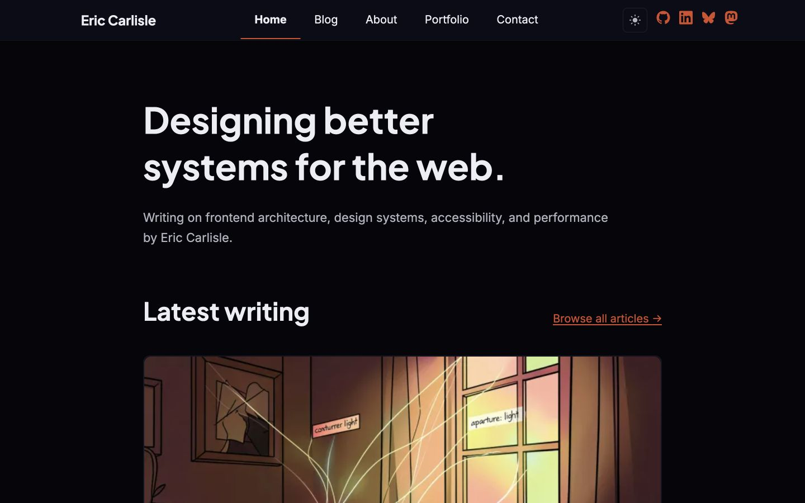

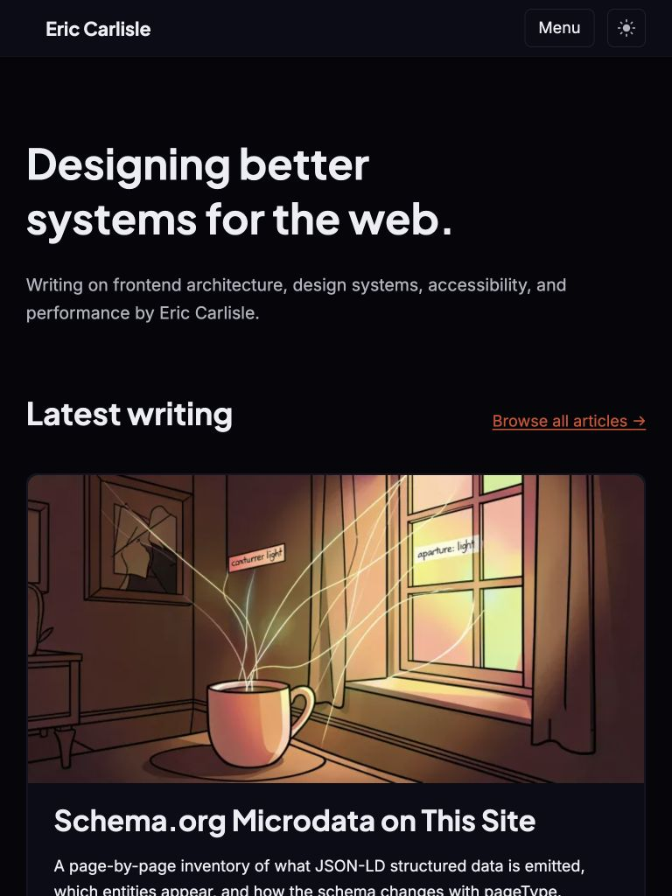

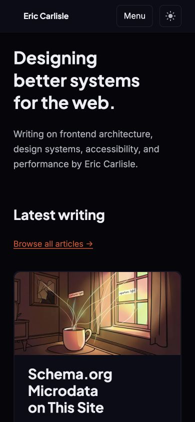

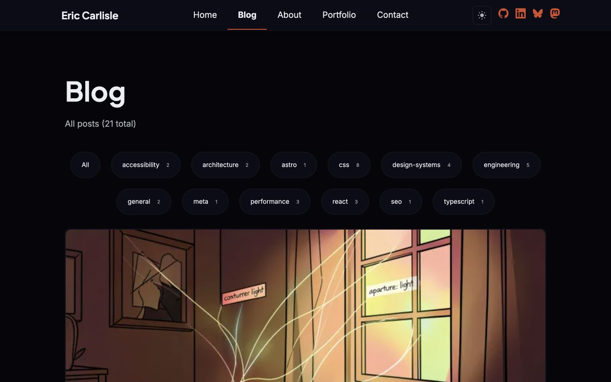

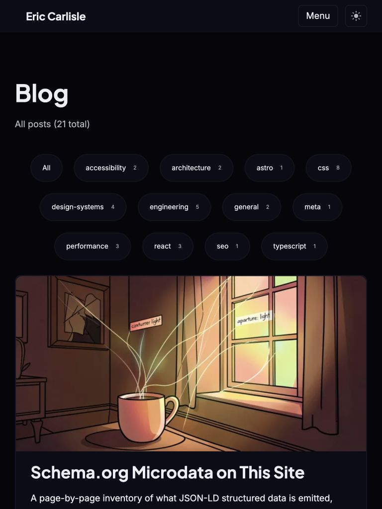

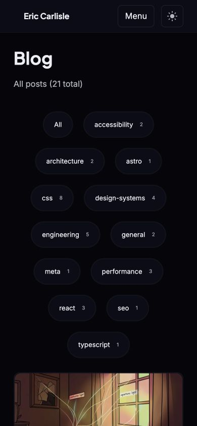

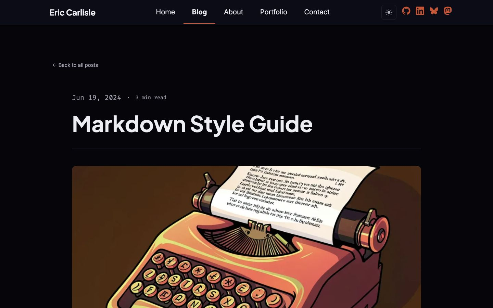

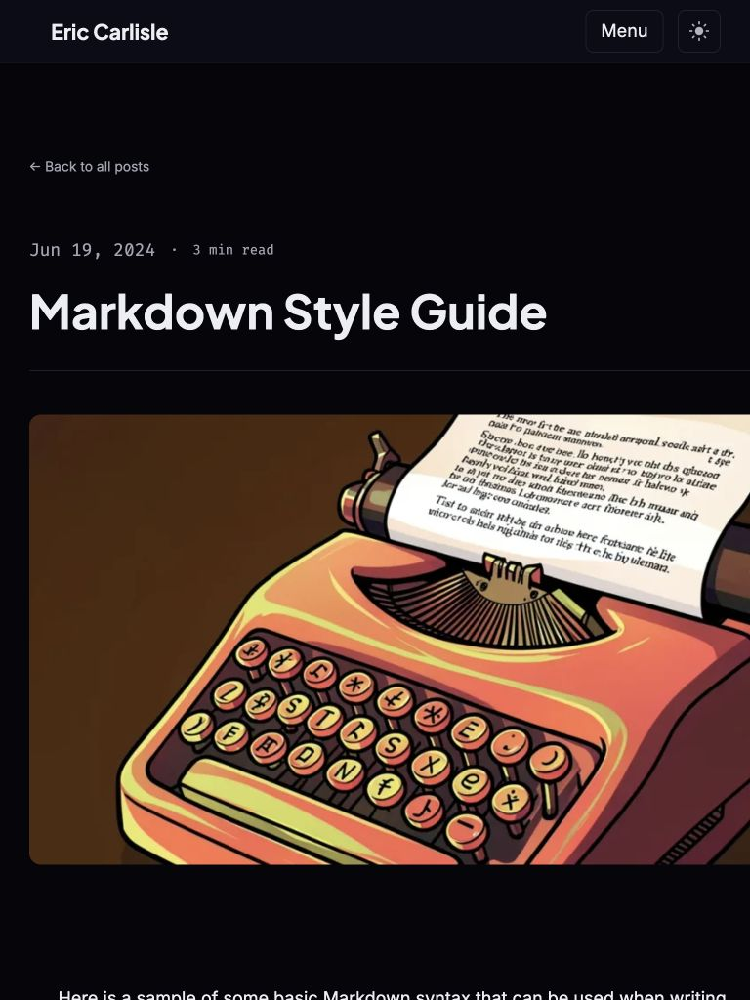

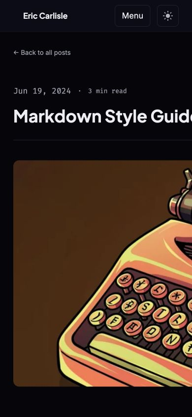

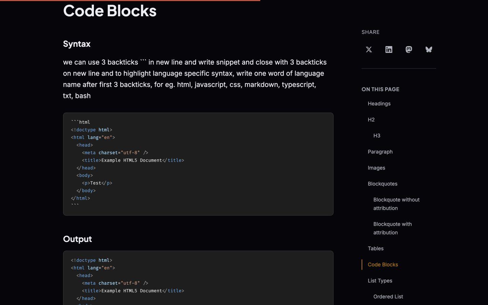

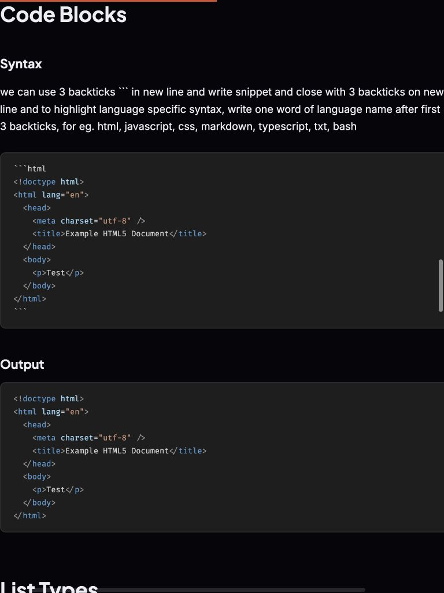

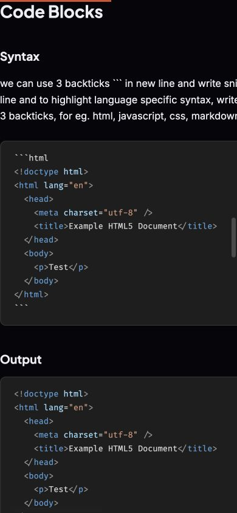

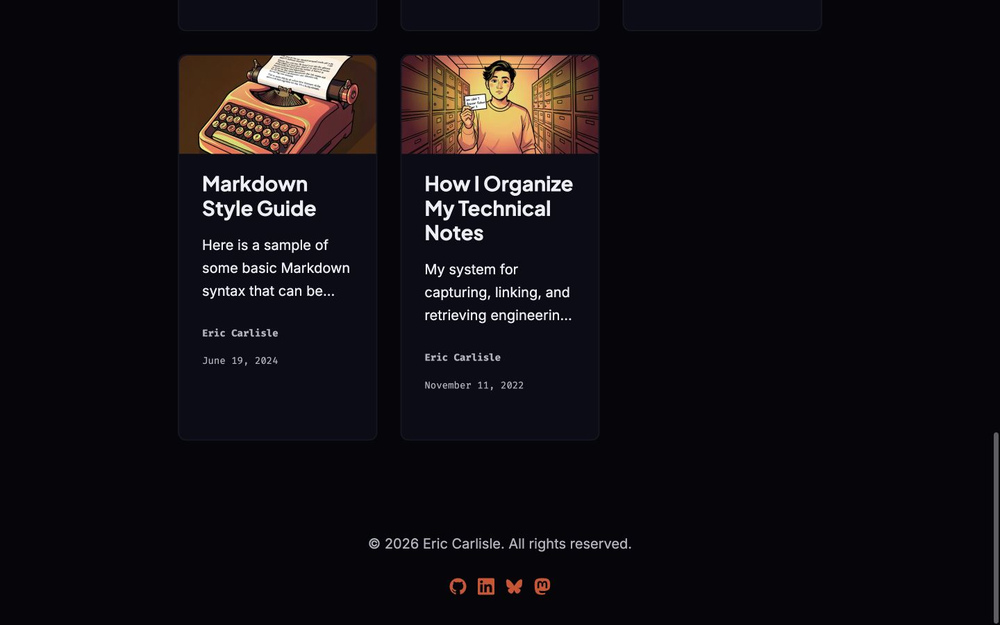

## Typography tokens

```css
--font-copy: "Inter Variable", system-ui, sans-serif;
--font-headers: "Plus Jakarta Sans Variable", system-ui, sans-serif;
--font-mono: "Fira Code Variable", ui-monospace, monospace;
--type-size-body: clamp(1rem, calc(0.45vw + 0.91rem), 1.25rem);
--type-size-small: clamp(0.8125rem, calc(0.2vw + 0.77rem), 0.9375rem);
--type-size-h1: clamp(2rem, calc(3.64vw + 1.27rem), 4rem);
--type-size-h2: clamp(1.625rem, calc(2.13vw + 1.2rem), 2.8rem);
--type-size-h3: clamp(1.375rem, calc(1.14vw + 1.15rem), 2rem);
--type-size-h4: clamp(1.125rem, calc(0.57vw + 1.07rem), 1.5rem);
--type-size-h5: clamp(1rem, calc(0.28vw + 0.94rem), 1.1875rem);
--type-size-base: var(--type-size-body);
--type-size-large: clamp(1.125rem, calc(0.35vw + 1.05rem), 1.375rem);
--type-size-card-title: clamp(1.375rem, calc(0.7vw + 1.2rem), 2rem);
--type-size-featured-card-title: clamp(1.75rem, calc(1.25vw + 1.45rem), 2.75rem);
--type-size-blockquote: 1.1em;
--line-height-body: 1.65;
--line-height-h1: 1.3;
--line-height-h2: 1.35;
--line-height-h3: 1.45;
--line-height-h4: 1.55;
--line-height-h5: 1.6;
```

Font files are self-hosted through Fontsource imports in `global.css`: Inter Variable for body copy, Plus Jakarta Sans Variable for headings, and Fira Code Variable for monospaced content.

## Color tokens

```css
--bg-main: oklch(0.12 0.015 280);
--bg-surface: oklch(0.16 0.02 280);
--bg-surface-elevated: oklch(0.2 0.025 280);
--text-primary: oklch(0.95 0.008 280);
--text-secondary: oklch(0.77 0.015 280);
--text-muted: oklch(0.72 0.02 280);
--brand-primary: oklch(0.64 0.16 75);
--brand-accent: oklch(0.6 0.18 35);
--brand-highlight: oklch(0.81 0.15 110);
--neutral-anchor: oklch(0.58 0.08 230);
--accent-cold: oklch(0.69 0.15 250);
--border-main: oklch(0.25 0.025 280);
--border-muted: oklch(0.19 0.015 280);
--border-control: oklch(0.52 0.04 280);
--color-link: var(--brand-accent);
--color-link-hover: var(--brand-highlight);
--color-action: var(--brand-primary);
--color-action-hover: var(--brand-highlight);
--color-focus: var(--brand-accent);
--color-success: var(--brand-highlight);
--bg-main: oklch(0.985 0.003 280);
--bg-surface: oklch(1 0 0);
--bg-surface-elevated: oklch(0.92 0.008 280);
--text-primary: oklch(0.13 0.015 280);
--text-secondary: oklch(0.25 0.02 280);
--text-muted: oklch(0.38 0.025 280);
--brand-primary: oklch(0.55 0.15 75);
--brand-accent: oklch(0.46 0.16 35);
--brand-highlight: oklch(0.45 0.14 110);
--neutral-anchor: oklch(0.35 0.06 230);
--accent-cold: oklch(0.52 0.14 250);
--border-main: oklch(0.85 0.01 280);
--border-muted: oklch(0.92 0.005 280);
--border-control: oklch(0.62 0.03 280);
```

The unqualified `:root` values form the default dark theme. `[data-theme="light"]` overrides the palette. Theme choice is persisted in `localStorage`; only a stored `light` value adds the light-theme attribute. The captured browser state was the default dark theme.

## Spacing and layout tokens

```css
--radius-sm: 4px;
--radius-md: 8px;
--radius-lg: 12px;
--rhythm: clamp(1.65rem, calc(0.75vw + 1.5rem), 2.0625rem);
--space-xs: calc(var(--rhythm) * 0.5);
--space-sm: calc(var(--rhythm) * 0.75);
--space-md: calc(var(--rhythm) * 1);
--space-lg: calc(var(--rhythm) * 1.5);
--space-xl: calc(var(--rhythm) * 2);
--space-inline: var(--space-xs);
--space-inline-strong: var(--space-sm);
--space-component: var(--space-md);
--space-component-lg: var(--space-lg);
--space-section: calc(var(--rhythm) * 2.5);
--space-layout: calc(var(--rhythm) * 3);
--focus-outline-width: var(--size-border-pixel);
--focus-outline-style: dashed;
--focus-outline-color: var(--color-focus);
--focus-outline-offset: 4px;
--transition-fast: 0.15s ease-out;
--transition-normal: 0.25s ease-out;
--transition-slow: 0.4s ease-out;
--size-border-pixel: 2px;
--size-border-thick: 4px;
--size-touch-target-min: 44px;
--layout-max-width: 68ch;
--layout-max-width-wide: 75rem;
--bp-mobile: 720px;
```

## Media queries

- `src/styles/components.css` — `@media (max-width: 720px)`
- `src/styles/components.css` — `@media (max-width: 720px)`
- `src/styles/components.css` — `@media (max-width: 720px)`
- `src/styles/global.css` — `@media (prefers-reduced-motion: no-preference)`
- `src/styles/global.css` — `@media (prefers-reduced-motion: reduce)`
- `src/styles/global.css` — `@media (max-width: 720px)`
- `src/styles/global.css` — `@media (prefers-reduced-motion: no-preference)`
- `src/layouts/BlogPost.astro` — `@media (min-width: 1024px)`
- `src/components/Header.astro` — `@media (prefers-reduced-motion: reduce)`
- `src/components/Header.astro` — `@media (max-width: 1024px)`
- `src/components/Header.astro` — `@media (max-width: 840px)`
- `src/components/Header.astro` — `@media (max-width: 420px)`
- `src/components/ThemeToggle.astro` — `@media (prefers-reduced-motion: reduce)`
- `src/pages/index.astro` — `@media (max-width: 600px)`
- `src/pages/portfolio.astro` — `@media (max-width: 800px)`
- `src/pages/portfolio.astro` — `@media (max-width: 720px)`

The CSS custom property `--bp-mobile: 720px` is documentary; native CSS custom properties cannot be substituted into media-query conditions, so source rules use literal breakpoint values.

## Layout wrappers and visual rails

- `body`: flex column, minimum viewport height, default dark background, body font and fluid body size. A global style in `Header.astro` adds top padding equal to the measured fixed-header height.
- `.site-frame`: shared component padding used by the header and footer.
- `main`: centered, `--layout-max-width-wide` (75rem) maximum width with fluid-token padding; reduced to component padding at 720px.
- `.prose`: centered content wrapper. Paragraphs and list items are limited to `--layout-max-width` (68ch); article/page content adds component padding in the layout.
- `article` and `.page-header`: the shared layout centers standard headers at the reading width and article headers/heroes at 1020px.
- `.post-layout`: single column by default; at 1024px article pages become content plus a 220px sidebar. Non-article pages remain one column.
- `.post-sidebar-inner` and `.toc`: sticky desktop article controls/TOC.
- `.grid.grid--cards`: auto-fit card grid with a 280px minimum; the first card spans the full grid and uses a larger title until the 720px single-column breakpoint.
- `.collection-header`: consistent index-page heading/description spacing.
- `.feed`: semantic wrapper on home/blog/tag collection pages; feed list reset lives in `feed.css`.
- `header.site-header`: fixed responsive navigation, with social links hidden by 1024px and the menu control enabled by 840px.
- `footer.site-frame`: centered copyright and social links.

## Astro scoped-style inventory and relevant markup

Astro scopes ordinary `<style>` blocks to the component that declares them. The exception below is the explicit `<style is:global>` block in `Header.astro`.

| File | Style block type | Representative classes/markup |
| --- | --- | --- |
| `src/layouts/BlogPost.astro` | scoped | .reading-progress, .skip-link, .back-link, .date, .reading-time, .last-updated-on, .hero-image, .post-content, .prose, .article-tags |
| `src/components/Card.astro` | scoped | .card-image, .prose, .card-title, .card-link, .meta, .reading-time, .meta-tags, .tag, .card-footer |
| `src/components/Footer.astro` | scoped | .site-frame, .social-links |
| `src/components/Header.astro` | scoped + global | .site-header, .site-frame, .internal-links, .nav-controls, .menu-toggle, .social-links |
| `src/components/HeaderLink.astro` | scoped | semantic/root markup |
| `src/components/PostGrid.astro` | scoped | .grid, .grid--cards |
| `src/components/ShareStrip.astro` | scoped | .share, .share-label, .share-links |
| `src/components/TagFilterBar.astro` | scoped | .filter-bar |
| `src/components/ThemeToggle.astro` | scoped | .theme-toggle, .icon, .icon--sun, .icon--moon |
| `src/components/Webmentions.astro` | scoped | .webmentions, .webmentions-heading, .wm-reactions, .wm-avatar, .wm-avatar-fallback, .wm-reaction-label, .wm-reply, .wm-reply-header, .wm-reply-avatar, .wm-reply-author |
| `src/pages/404.astro` | scoped | .skip-link, .not-found, .not-found-code, .not-found-label, .button |
| `src/pages/contact.astro` | scoped | .contact-success, .prose, .contact-section, .contact-form, .honeypot, .cf-turnstile, .button, .contact-submit, .contact-error |
| `src/pages/index.astro` | scoped | .skip-link, .home-intro, .feed, .collection-header, .feed-heading, .grid, .grid--cards |
| `src/pages/portfolio.astro` | scoped | .portfolio-hero, .lede, .portfolio-note, .case-studies, .case-study, .case-study-overview, .meta, .repo-links, .repo-links-label, .repo-list |
| `src/pages/tags/index.astro` | scoped | .skip-link, .tags-index, .collection-header, .collection-description, .tags-index-list, .tag-card, .tag-card-name, .tag-card-count, .callout |

Complete markup and scoped style blocks for every layout and component are preserved verbatim in `source-style-export.md`. The key structure is:

- `Header.astro`: `<header class="site-header site-frame">` containing the main `<nav>`, internal links, responsive menu button, theme toggle, and social controls.
- `Footer.astro`: `<footer class="site-frame">` containing copyright text and social links.
- `Card.astro`: configurable `div`, `article`, or `li` root with `.card`, optional image slot, `.prose`, title link, metadata, tags, and optional footer slot.
- `PostGrid.astro`: `<ul class="grid grid--cards">` of `Card` components.
- `BlogPost.astro`: shared shell with `<main>`, `<article>`, `.page-header`, optional hero, `.post-layout`, `.post-content > .prose`, and optional `<aside class="post-sidebar">`.

## Notes that affect visual evaluation

- The default theme is dark; a light theme exists and is activated only by the user toggle/stored preference. This bundle captures dark mode only.
- The fixed header measures itself with `ResizeObserver` and writes `--header-height`; it also hides/reveals based on scroll direction.
- Responsive navigation changes at 840px; desktop social links are hidden at 1024px; the smallest header title adjustment is at 420px.
- Article layout changes to two columns at 1024px, so the 768px capture intentionally has no desktop sidebar column.
- The main reading rail is 68ch; the overall page rail is 75rem; article headers and heroes cap at 1020px.
- Heading and body sizes use `clamp()`; spacing is derived from a fluid baseline-rhythm token.
- Cards use view-timeline entry animation when supported and reduced motion is not requested. Reduced-motion rules collapse animation and transition duration.
- Expressive Code provides syntax-highlighted code rendering; `global.css` also contains fallback `code` and `pre` styles.
- Most Astro component styles are scoped. Global component primitives are in `components.css`; Pagefind overrides use deliberately high specificity.
- Home and blog index routes import `feed.css` directly in addition to the global stylesheet chain.
- Hero/card images use Astro image processing and responsive source generation.
- Captures were taken from the already-running local Astro dev server at `localhost:4321`. No dependency installation or build was needed.

## Global CSS file contents

### `src/styles/components.css`

``````css
.card {
  position: relative;
  padding: var(--space-component);
  background: var(--bg-surface);
  border: var(--size-border-pixel) solid var(--bg-surface-elevated);
  border-radius: var(--radius-lg);
  transition:
    transform var(--transition-normal),
    box-shadow var(--transition-normal),
    border-color var(--transition-normal);
}

.card .card-title {
  margin: 0;
  font-size: var(--type-size-card-title);
  line-height: 1.2;
}

.card .prose > p:not(.meta) {
  display: -webkit-box;
  overflow: hidden;
  -webkit-box-orient: vertical;
  -webkit-line-clamp: 3;
}

.card:hover {
  transform: translateY(-4px);
  box-shadow: 0 8px 24px oklch(0 0 0 / 0.15);
  border-color: var(--color-action);
}

.card > * + * {
  margin-top: var(--space-inline-strong);
}

.card-image {
  margin: calc(-1 * var(--space-component));
  margin-bottom: var(--space-inline-strong);
  border-radius: var(--radius-lg) var(--radius-lg) 0 0;
  overflow: hidden;
}

.card-image img {
  display: block;
  width: 100%;
  height: auto;
  aspect-ratio: 2 / 1;
  transition: transform var(--transition-slow);
}

.card:hover .card-image img {
  transform: scale(1.03);
}

.callout {
  padding: var(--space-component);
  border-left: var(--size-border-thick) solid var(--color-link);
  background: var(--bg-surface);
  border-radius: var(--radius-md);
  color: var(--text-secondary);
}

.callout strong {
  color: var(--text-primary);
}

.tag {
  display: inline-flex;
  align-items: center;
  padding: 0.2em 0.6em;
  font-family: var(--font-mono);
  font-size: var(--type-size-small);
  border-radius: 999px;
  background: var(--bg-surface-elevated);
  color: var(--text-secondary);
  text-decoration: none;
  transition:
    background var(--transition-fast),
    color var(--transition-fast);
}

.tag:hover {
  background: var(--color-action);
  color: var(--bg-main);
}

.meta {
  font-size: var(--type-size-small);
  color: var(--text-muted);
  display: flex;
  gap: var(--space-inline);
  flex-wrap: wrap;
  align-items: center;
}

.meta time,
.meta strong {
  font-family: var(--font-mono);
  color: var(--text-secondary);
  font-size: 0.9375em;
}

.meta .tag {
  font-family: var(--font-mono);
  font-size: inherit;
}

.grid {
  display: grid;
  gap: var(--space-component);
}

.grid--cards {
  grid-template-columns: repeat(auto-fit, minmax(280px, 1fr));
}

.grid--cards > :first-child {
  grid-column: 1 / -1;
}

.grid--cards > :first-child .card-title {
  font-size: var(--type-size-featured-card-title);
}

.collection-header {
  margin-bottom: var(--space-component-lg);
}

.collection-header h1 {
  margin-bottom: var(--space-inline);
}

.collection-description {
  margin-bottom: 0;
  color: var(--text-secondary);
}

@media (max-width: 720px) {
  .grid--cards {
    grid-template-columns: 1fr;
  }

  .grid--cards > :first-child {
    grid-column: auto;
  }
}

.button {
  display: inline-flex;
  align-items: center;
  justify-content: center;
  padding: var(--space-inline) var(--space-component);
  border-radius: var(--radius-md);
  background: var(--color-action);
  color: var(--bg-surface);
  border: none;
  text-decoration: none;
  font-size: var(--type-size-body);
  cursor: pointer;
  transition:
    background var(--transition-fast),
    transform var(--transition-fast);
}

.button:hover {
  background: var(--color-action-hover);
  transform: translateY(-1px);
}

.post-nav {
  display: grid;
  grid-template-columns: 1fr 1fr;
  gap: var(--space-component);
  margin-top: var(--space-xl);
  padding-top: var(--space-component);
  border-top: var(--size-border-pixel) solid var(--border-main);
}

.post-nav a {
  padding: var(--space-component);
  background: var(--bg-surface);
  border: var(--size-border-pixel) solid var(--border-muted);
  border-radius: var(--radius-md);
  text-decoration: none;
  color: var(--text-primary);
  transition:
    border-color var(--transition-fast),
    background var(--transition-fast);
}

.post-nav a:hover {
  border-color: var(--brand-primary);
  background: var(--bg-surface-elevated);
}

.post-nav .post-nav-label {
  display: block;
  margin-bottom: var(--space-xs);
  color: var(--text-muted);
  font-size: var(--type-size-small);
}

.post-nav .post-nav-title {
  font-family: var(--font-headers);
  font-weight: 700;
}

.post-nav .post-nav-next {
  text-align: right;
}

@media (max-width: 720px) {
  .post-nav {
    grid-template-columns: 1fr;
  }

  .post-nav .post-nav-next {
    text-align: left;
  }
}

.toc {
  position: sticky;
  top: calc(var(--header-height, 4.5rem) + var(--space-component));
  font-size: var(--type-size-small);
}

.toc h3 {
  margin-bottom: var(--space-inline);
  color: var(--text-muted);
  font-size: inherit;
  text-transform: uppercase;
  letter-spacing: 0.05em;
}

.toc nav ul {
  list-style: none;
  padding: 0;
  margin: 0;
}

.toc nav li {
  margin-bottom: var(--space-xs);
}

.toc nav a {
  display: block;
  padding: 0.2em 0;
  padding-left: var(--space-inline);
  color: var(--text-secondary);
  border-left: var(--size-border-pixel) solid transparent;
  text-decoration: none;
  transition:
    color var(--transition-fast),
    border-color var(--transition-fast);
}

.toc nav a:hover,
.toc nav a.active {
  color: var(--color-action);
  border-left-color: var(--color-action);
}

.back-link {
  display: inline-flex;
  align-items: center;
  gap: var(--space-xs);
  margin-bottom: var(--space-component);
  color: var(--text-muted);
  font-size: var(--type-size-small);
  text-decoration: none;
  transition: color var(--transition-fast);
}

.back-link:hover {
  color: var(--color-link);
}

.reading-time {
  color: var(--text-muted);
  font-family: var(--font-mono);
  font-size: var(--type-size-small);
}

.reading-time::before {
  content: "\00b7";
  margin: 0 var(--space-inline);
}

.stats-grid {
  display: grid;
  grid-template-columns: repeat(4, 1fr);
  gap: var(--space-component);
  max-width: var(--layout-max-width);
  margin-inline: auto;
  margin-bottom: var(--space-section);
}

.stat {
  padding: var(--space-component);
  text-align: center;
  background: var(--bg-surface);
  border: var(--size-border-pixel) solid var(--border-muted);
  border-radius: var(--radius-md);
}

.stat-value {
  display: block;
  color: var(--color-action);
  font-family: var(--font-mono);
  font-size: var(--type-size-h3);
  font-weight: 700;
  line-height: 1.2;
}

.stat-label {
  display: block;
  margin-top: var(--space-xs);
  color: var(--text-secondary);
  font-family: var(--font-mono);
  font-size: var(--type-size-small);
}

@media (max-width: 720px) {
  .stats-grid {
    grid-template-columns: repeat(2, 1fr);
  }
}
``````

### `src/styles/feed.css`

``````css
ul.grid {
  list-style: none;
  padding: 0;
  margin: 0;
}

#no-results {
  text-align: center;
  margin-bottom: var(--space-component);
}
``````

### `src/styles/global.css`

``````css
@import "@fontsource-variable/inter/wght.css";
@import "@fontsource-variable/plus-jakarta-sans/wght.css";
@import "@fontsource-variable/fira-code/wght.css";
@import "./components.css";
@import "./pagefind.css";

:root {
  /* Fonts */
  --font-copy: "Inter Variable", system-ui, sans-serif;
  --font-headers: "Plus Jakarta Sans Variable", system-ui, sans-serif;
  --font-mono: "Fira Code Variable", ui-monospace, monospace;

  /* Type sizes */
  --type-size-body: clamp(1rem, calc(0.45vw + 0.91rem), 1.25rem); /* 16px -> 20px */
  --type-size-small: clamp(0.8125rem, calc(0.2vw + 0.77rem), 0.9375rem); /* 13px -> 15px */
  --type-size-h1: clamp(2rem, calc(3.64vw + 1.27rem), 4rem); /* 32px -> 64px */
  --type-size-h2: clamp(1.625rem, calc(2.13vw + 1.2rem), 2.8rem); /* 26px -> 45px */
  --type-size-h3: clamp(1.375rem, calc(1.14vw + 1.15rem), 2rem); /* 22px -> 32px */
  --type-size-h4: clamp(1.125rem, calc(0.57vw + 1.07rem), 1.5rem); /* 18px -> 24px */
  --type-size-h5: clamp(1rem, calc(0.28vw + 0.94rem), 1.1875rem); /* 16px -> 19px */
  --type-size-base: var(--type-size-body);
  --type-size-large: clamp(1.125rem, calc(0.35vw + 1.05rem), 1.375rem);
  --type-size-card-title: clamp(1.375rem, calc(0.7vw + 1.2rem), 2rem);
  --type-size-featured-card-title: clamp(1.75rem, calc(1.25vw + 1.45rem), 2.75rem);
  --type-size-blockquote: 1.1em;

  /* Line heights */
  --line-height-body: 1.65;
  --line-height-h1: 1.3;
  --line-height-h2: 1.35;
  --line-height-h3: 1.45;
  --line-height-h4: 1.55;
  --line-height-h5: 1.6;

  /* Radii */
  --radius-sm: 4px;
  --radius-md: 8px;
  --radius-lg: 12px;

  /* ========================================================================
     Warm Dark Theme (OKLCH) — amber/coral editorial palette
     ======================================================================== */
  --bg-main: oklch(0.12 0.015 280);
  --bg-surface: oklch(0.16 0.02 280);
  --bg-surface-elevated: oklch(0.2 0.025 280);

  --text-primary: oklch(0.95 0.008 280);
  --text-secondary: oklch(0.77 0.015 280);
  --text-muted: oklch(0.72 0.02 280);

  /* Primary Amber */
  --brand-primary: oklch(0.64 0.16 75);
  /* Accent Coral */
  --brand-accent: oklch(0.6 0.18 35);
  /* Highlight Chartreuse */
  --brand-highlight: oklch(0.81 0.15 110);
  /* Anchor Slate */
  --neutral-anchor: oklch(0.58 0.08 230);
  /* Interaction Cerulean */
  --accent-cold: oklch(0.69 0.15 250);

  --border-main: oklch(0.25 0.025 280);
  --border-muted: oklch(0.19 0.015 280);
  --border-control: oklch(0.52 0.04 280);

  /* Vertical rhythm follows the fluid body line box: 26.4px -> 33px. */
  --rhythm: clamp(1.65rem, calc(0.75vw + 1.5rem), 2.0625rem);

  /* Spacing — clean multiples of the baseline rhythm */
  --space-xs: calc(var(--rhythm) * 0.5);
  --space-sm: calc(var(--rhythm) * 0.75);
  --space-md: calc(var(--rhythm) * 1);
  --space-lg: calc(var(--rhythm) * 1.5);
  --space-xl: calc(var(--rhythm) * 2);

  /* Semantic spacing */
  --space-inline: var(--space-xs);
  --space-inline-strong: var(--space-sm);
  --space-component: var(--space-md);
  --space-component-lg: var(--space-lg);
  --space-section: calc(var(--rhythm) * 2.5);
  --space-layout: calc(var(--rhythm) * 3);

  /* Semantic color roles */
  --color-link: var(--brand-accent);
  --color-link-hover: var(--brand-highlight);
  --color-action: var(--brand-primary);
  --color-action-hover: var(--brand-highlight);
  --color-focus: var(--brand-accent);
  --color-success: var(--brand-highlight);

  --focus-outline-width: var(--size-border-pixel);
  --focus-outline-style: dashed;
  --focus-outline-color: var(--color-focus);
  --focus-outline-offset: 4px;

  /* Transition & motion tokens */
  --transition-fast: 0.15s ease-out;
  --transition-normal: 0.25s ease-out;
  --transition-slow: 0.4s ease-out;

  /* Structural sizing tokens */
  --size-border-pixel: 2px;
  --size-border-thick: 4px;
  --size-touch-target-min: 44px;

  /* Layout */
  --layout-max-width: 68ch;
  --layout-max-width-wide: 75rem;

  /* Breakpoints */
  --bp-mobile: 720px;
}

/* ========================================================================
   Light theme: explicit user toggle.
   ======================================================================== */
[data-theme="light"] {
  --bg-main: oklch(0.985 0.003 280);
  --bg-surface: oklch(1 0 0);
  --bg-surface-elevated: oklch(0.92 0.008 280);

  --text-primary: oklch(0.13 0.015 280);
  --text-secondary: oklch(0.25 0.02 280);
  --text-muted: oklch(0.38 0.025 280);

  /* Rich Amber */
  --brand-primary: oklch(0.55 0.15 75);
  /* Deep Coral */
  --brand-accent: oklch(0.46 0.16 35);
  /* High-Contrast Chartreuse */
  --brand-highlight: oklch(0.45 0.14 110);
  /* Dark Slate Anchor */
  --neutral-anchor: oklch(0.35 0.06 230);
  /* Deep Interactive Cerulean */
  --accent-cold: oklch(0.52 0.14 250);

  --border-main: oklch(0.85 0.01 280);
  --border-muted: oklch(0.92 0.005 280);
  --border-control: oklch(0.62 0.03 280);
}

html {
  box-sizing: border-box;
  min-height: 100%;
  color-scheme: dark light;
}

@media (prefers-reduced-motion: no-preference) {
  html {
    scroll-behavior: smooth;
  }
}

@media (prefers-reduced-motion: reduce) {
  *,
  *::before,
  *::after {
    animation-duration: 0.01ms !important;
    animation-iteration-count: 1 !important;
    transition-duration: 0.01ms !important;
    scroll-behavior: auto !important;
  }
}

img {
  max-width: 100%;
  height: auto;
}

*,
*::before,
*::after {
  box-sizing: inherit;
}

/* =========================
   PAGE STRUCTURE
   ========================= */

body {
  margin: 0;
  padding: 0;
  background: var(--bg-main);
  color: var(--text-primary);
  font-family: var(--font-copy);
  font-size: var(--type-size-body);
  line-height: var(--line-height-body);
  text-align: left;
  overflow-wrap: break-word;
  min-height: 100vh;
  display: flex;
  flex-direction: column;
}

.site-frame {
  padding: var(--space-component);
}

main {
  max-width: var(--layout-max-width-wide);
  margin-inline: auto;
  padding: var(--space-layout) var(--space-component);
  flex: 1;
}

:focus-visible {
  outline: var(--size-border-pixel) dashed var(--color-focus);
  outline-offset: 4px;
}

::selection {
  background: var(--brand-primary);
  color: var(--bg-main);
}

/* =========================
   TYPOGRAPHY
   ========================= */

h1,
h2,
h3,
h4,
h5,
h6 {
  font-family: var(--font-headers);
  font-weight: 700;
  color: var(--text-primary);
  margin: 0;
}

h1,
h2,
h3 {
  text-wrap: balance;
}

h1 {
  font-size: var(--type-size-h1);
  line-height: var(--line-height-h1);
  margin-bottom: calc(var(--rhythm) * 1);
}
h2 {
  font-size: var(--type-size-h2);
  line-height: var(--line-height-h2);
  margin-top: calc(var(--rhythm) * 2);
  margin-bottom: calc(var(--rhythm) * 1);
}
h3 {
  font-size: var(--type-size-h3);
  line-height: var(--line-height-h3);
  margin-top: calc(var(--rhythm) * 1.5);
  margin-bottom: calc(var(--rhythm) * 0.5);
}
h4 {
  font-size: var(--type-size-h4);
  line-height: var(--line-height-h4);
  margin-top: calc(var(--rhythm) * 1.5);
  margin-bottom: calc(var(--rhythm) * 0.5);
}
h5 {
  font-size: var(--type-size-h5);
  line-height: var(--line-height-h5);
  margin-top: calc(var(--rhythm) * 1);
  margin-bottom: calc(var(--rhythm) * 0.5);
}

strong,
b {
  font-weight: 700;
}
em,
i {
  font-style: italic;
}

a {
  color: var(--color-link);
  text-decoration: underline;
  text-underline-offset: 0.15em;
  transition: color var(--transition-fast);
}

a:hover {
  color: var(--color-link-hover);
}

.prose {
  margin-inline: auto;
}

p {
  margin-bottom: var(--space-component);
}

.prose p,
.prose li {
  max-width: var(--layout-max-width);
}

.prose p {
  line-height: var(--line-height-body);
  text-wrap: pretty;
}

.prose h2,
.prose h3 {
  margin-top: var(--space-section);
}

code {
  padding: 0.2em 0.4em;
  background-color: var(--bg-surface);
  border-radius: var(--radius-sm);
  font-family: var(--font-mono);
  font-size: 0.95em;
}

pre {
  margin-bottom: var(--space-component);
  padding: var(--space-component);
  border-radius: var(--radius-md);
  background: var(--bg-surface);
  border: 1px solid var(--border-main);
  overflow-x: auto;
}

div.expressive-code {
  margin-bottom: var(--space-component);
}

blockquote {
  border-left: 4px solid var(--color-link);
  padding: 0 var(--space-component);
  margin: var(--space-section) 0;
  font-size: var(--type-size-blockquote);
  color: var(--text-secondary);
}

hr {
  border: none;
  border-top: 1px solid var(--border-main);
}

@media (max-width: 720px) {
  main {
    padding: var(--space-component);
  }
}

/* Skip-link */
.skip-link {
  position: absolute;
  top: -100%;
  left: var(--space-component);
  z-index: 9999;
  padding: var(--space-inline) var(--space-component);
  background: var(--bg-surface);
  color: var(--text-primary);
  border: var(--size-border-pixel) solid var(--color-focus);
  font-weight: 700;
  text-decoration: none;
  transition: top var(--transition-normal);
}

.skip-link:focus {
  top: var(--space-component);
}

.sr-only {
  border: 0;
  padding: 0;
  margin: 0;
  position: absolute !important;
  height: 1px;
  width: 1px;
  overflow: hidden;
  clip: rect(1px, 1px, 1px, 1px);
  clip-path: inset(50%);
  white-space: nowrap;
}

/* =========================
   READING PROGRESS BAR
   ========================= */
.reading-progress {
  position: fixed;
  top: 0;
  left: 0;
  z-index: 101;
  height: 3px;
  background: var(--color-link);
  width: 0%;
  pointer-events: none;
  transition: width 50ms linear;
}

/* =========================
   CARD ANIMATIONS
   ========================= */
@keyframes card-enter {
  from {
    opacity: 0;
    transform: translateY(1rem);
  }
  to {
    opacity: 1;
    transform: translateY(0);
  }
}

.card-enter {
  animation: card-enter 0.4s ease-out both;
}

@supports (animation-timeline: view()) {
  @media (prefers-reduced-motion: no-preference) {
    .card-enter {
      animation: card-enter 0.6s ease-out both;
      animation-timeline: view();
      animation-range: entry 0% entry 25%;
    }
  }
}
``````

### `src/styles/pagefind.css`

``````css
/* Reserve space to prevent CLS before Pagefind hydrates */
pagefind-modal {
  display: block;
  min-height: 0;
}

/* ========================================================================
   Pagefind Component UI — map --pf-* vars to design tokens
   Uses :root:root to beat Pagefind's own :root and [data-pf-theme="dark"]
   specificity (0,2,0 vs 0,1,1).
   ======================================================================== */
:root:root {
  --pf-text: var(--text-primary);
  --pf-text-secondary: var(--text-secondary);
  --pf-text-muted: var(--text-muted);
  --pf-background: var(--bg-surface);
  --pf-border: var(--border-main);
  --pf-border-focus: var(--brand-primary);
  --pf-skeleton: var(--bg-surface);
  --pf-skeleton-shine: var(--bg-surface-elevated);
  --pf-hover: oklch(0.22 0.025 280);
  --pf-mark: var(--brand-highlight);
  --pf-scroll-shadow: rgba(255, 255, 255, 0.08);

  --pf-shadow-sm: 0 2px 8px rgba(0, 0, 0, 0.3);
  --pf-shadow-md: 0 4px 12px rgba(0, 0, 0, 0.4);
  --pf-shadow-lg: 0 16px 48px rgba(0, 0, 0, 0.5);

  --pf-outline-focus: var(--brand-primary);
  --pf-modal-backdrop: rgba(0, 0, 0, 0.7);
  --pf-border-radius: var(--radius-lg);
  --pf-font: var(--font-copy);
  --pf-modal-max-width: 640px;
}

:root:root[data-theme="light"] {
  --pf-hover: oklch(0.92 0.008 280);
  --pf-mark: var(--brand-highlight);
  --pf-scroll-shadow: rgba(0, 0, 0, 0.08);

  --pf-shadow-sm: 0 2px 8px rgba(0, 0, 0, 0.06);
  --pf-shadow-md: 0 4px 12px rgba(0, 0, 0, 0.1);
  --pf-shadow-lg: 0 16px 48px rgba(0, 0, 0, 0.2);

  --pf-modal-backdrop: rgba(0, 0, 0, 0.5);
}

/* Header search trigger — match theme toggle styling.
   Pagefind uses :is(*,#\#):is(*,#\#):is(*,#\#) for (0,3,0). Match it. */
:is(*, #\#):is(*, #\#):is(*, #\#) pagefind-modal-trigger {
  display: flex;
  align-items: center;
  width: 44px;
  min-width: 44px;
}

:is(*, #\#):is(*, #\#):is(*, #\#) pagefind-modal-trigger .pf-trigger-btn {
  display: inline-flex;
  align-items: center;
  justify-content: center;
  width: 44px;
  height: 44px;
  padding: 0;
  background: transparent;
  border: none;
  border-radius: var(--radius-md);
  color: var(--text-secondary);
  cursor: pointer;
  transition:
    color var(--transition-fast),
    background var(--transition-fast);
}

:is(*, #\#):is(*, #\#):is(*, #\#) pagefind-modal-trigger .pf-trigger-btn:hover {
  color: var(--brand-primary);
  background: transparent;
}

:is(*, #\#):is(*, #\#):is(*, #\#) pagefind-modal-trigger .pf-trigger-btn:focus-visible {
  outline: var(--size-border-pixel) dashed var(--brand-accent);
  outline-offset: 3px;
}

:is(*, #\#):is(*, #\#):is(*, #\#) pagefind-modal-trigger .pf-trigger-icon {
  width: 20px;
  height: 20px;
  background: currentColor;
  -webkit-mask-image: var(--pf-icon-search);
  mask-image: var(--pf-icon-search);
  -webkit-mask-size: 100%;
  mask-size: 100%;
}

:is(*, #\#):is(*, #\#):is(*, #\#) pagefind-modal-trigger .pf-trigger-text,
:is(*, #\#):is(*, #\#):is(*, #\#) pagefind-modal-trigger .pf-trigger-shortcut {
  display: none;
}
``````
